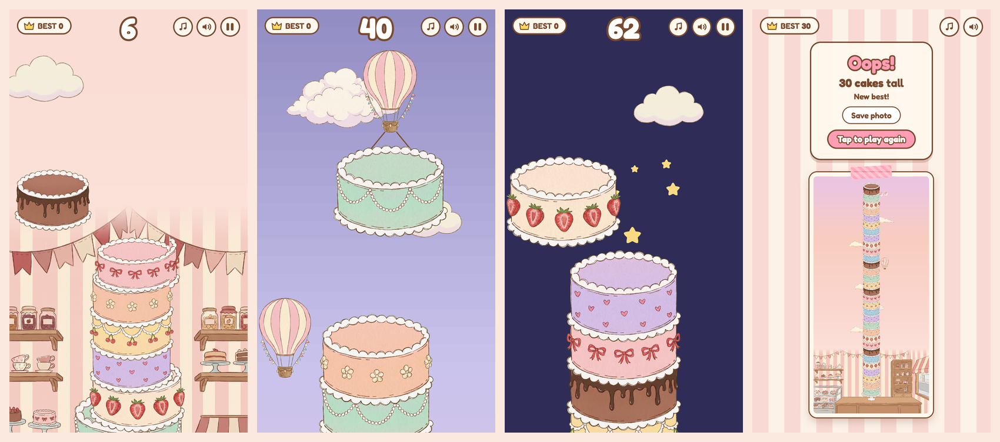

# 🍰 Cake Tower

A cozy **cake-stacking browser game**. Drop each sliding cake onto the tower, keep the layers lined up, and see how high you can build it, from the cake shop counter up past the clouds to the night sky.



## Try it

Play it in the browser on your phone or laptop, portrait or landscape: **[cake-tower-beta.vercel.app](https://cake-tower-beta.vercel.app)**

## Run locally

```bash
git clone https://github.com/GianneAngely/cake-tower.git
cd cake-tower
open index.html
```

There is no build step. The game runs straight from the file.

## Controls

- **Tap, click or Space** — drop the cake
- **Perfect** — land it exactly on top to keep the cake full size; three in a row grow it back
- **Balloon cakes** — from 40 cakes, some swing in under a balloon, so let go a little early
- **Sugar rush** — past 100 cakes, everything speeds up
- **Save photo** — keep a picture of your whole tower when the game ends
- **Music and sound** — switch each one off with the buttons in the top right

## Built with

Phaser 3 · JavaScript · Web Audio
The music and sound effects are synthesized in the browser, so the game ships without audio files.
