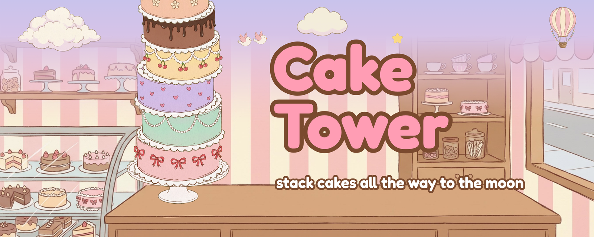
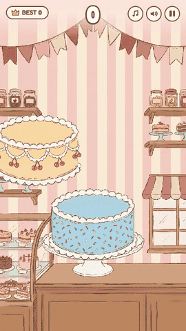
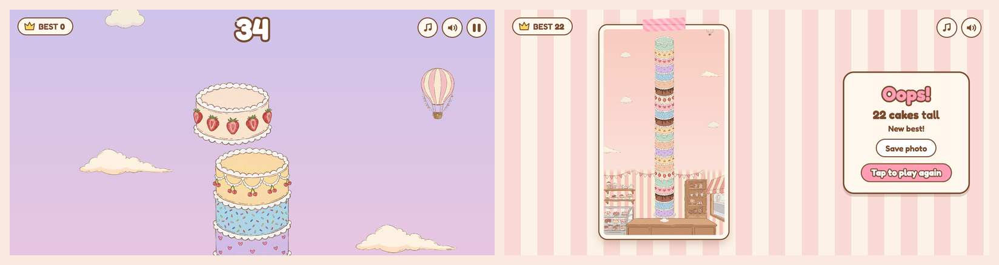
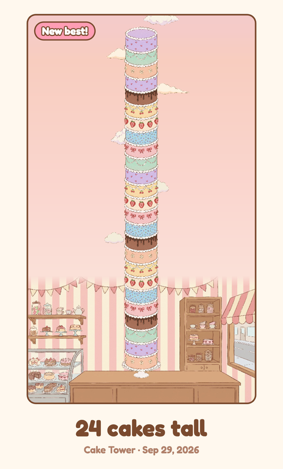

# 🍰 Cake Tower

A cozy **cake-stacking browser game**. Drop each sliding cake onto the tower, keep the layers lined up, and build it from the cake shop counter up past the clouds, the balloons and the moon.



<p align="center">
  <a href="https://caketower.vercel.app"><b>🎮 Play it at caketower.vercel.app</b></a><br>
  <sub>also on <a href="https://gianneangely.itch.io/cake-tower">itch.io</a></sub>
</p>

<p align="center">
  
</p>

## How to play

1. Tap, click or press **Space** to drop the sliding cake.
2. Anything that hangs over the edge is cut off, so the next cake is a little smaller.
3. Land a cake exactly on top for a **Perfect**. Three Perfects in a row grow the cake back.
4. Keep stacking until a cake misses the tower, then save a photo of what you built.

## What's inside

- **Eight cakes** — strawberry bows, mint pearls, lavender hearts, cherry, chocolate drip, peach flowers, sprinkles and strawberry vanilla
- **A sky that changes as you climb** — clouds and birds by day, hot-air balloons at dusk, a sleepy moon and stars at night
- **Balloon cakes** — from 40 cakes, some swing in under a balloon, so let go a little early
- **Sugar rush** — past 100 cakes, everything speeds up and Perfects get stricter
- **Tower photo** — when the game ends, the camera pulls back and frames your whole tower as a photo you can save or share
- **Music-box soundtrack** — the music and sound effects are synthesized live in the browser, and the tune slows down at night
- **Any screen** — portrait or landscape, phone or desktop

## Screenshots




<p align="center">
  <br>
  <sub>The photo you get from <b>Save photo</b></sub>
</p>

## Run locally

```bash
git clone https://github.com/GianneAngely/cake-tower.git
cd cake-tower
open index.html
```

There is no build step. The game runs straight from the file, offline too.

## Built with

Phaser 3 · JavaScript · Web Audio · Python
Python scripts in `tools/` cut and pack the art. The Fredoka font is used under the SIL Open Font License, and Phaser under the MIT License.
